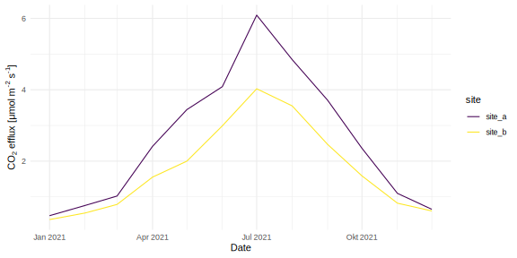
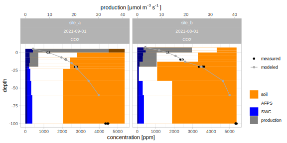
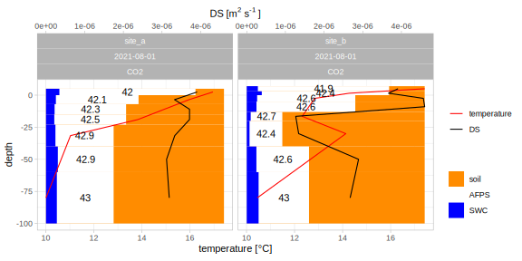

<!-- README.md is generated from README.Rmd. Please edit that file -->
<!-- badges: start -->

[](https://lifecycle.r-lib.org/articles/stages.html#experimental)
[](https://CRAN.R-project.org/package=ConFluxPro)
<!-- badges: end -->

# ConFluxPro <a></a>

ConFluxPro is a free toolbox for modelling soil gas fluxes using the
Flux Gradient Method (FGM). It provides functions for data preparation,
a framework for model set-up and implements different FGM models,
including an inverse approach.

<!-- TODO: Insert text to link to papers  -->

## Installation

Install the current development version from github:

``` r
# install.packages("remotes")
remotes::install_github("valentingar/ConFluxPro")
```

To get started, check out the provided vignette after installation:

``` r
vignette("overview", package = "ConFluxPro")
```

## Basis

The Flux Gradient Method (FGM) calculates diffusive flux rates $F$ of
gases from vertical concentration gradients $dc/dz$ in the soil air and
the apparent diffusion coefficient coefficient $D_s$.

$$
F= -D_s\cdot \frac{dc}{dz}
$$

The FGM is an excellent alternative to other methods, such as
Eddy-Covariance or chamber measurements, that can be costly or work
intensive. By measuring the concentration gradients in the soil and
deriving the apparent diffusion coefficient from soil physical
parameters, a continuous and low-impact measurement of soil gas fluxes
and vertical production profiles is possible.

While the basic calculation of fluxes may be simple, FGM requires the
combination of different datasets of varying methods. This is where
ConFluxPro comes in. This package can help to easily process raw data,
combine datasets and set up different model variants in a
straightforward and reproducible manner.

For more background, see a
[review](https://doi.org/10.1016/j.agrformet.2014.03.006) on the method
and how it can be deployed especially for [long-term
monitoring](https://doi.org/10.3390/app10238653) of soil gas fluxes.
<!-- TODO: link to own paper as well -->
<!-- TODO: link to paper where CFP has been used -->

## Workflow

### Data handling

A central idea in ConFluxPro is that each distinct profile, i.e. a
single time point at a given site for a given gas, can be uniquely
identified by a set of columns called `id_cols`.

Different classes help to set up and validate datasets:

- `cfp_gasdata()` A `data.frame` where for each profile there is
  concentration data in a column `x_ppm` at different depths in column
  `depth`.
- `cfp_soilphys()` A `data.frame` with soil physical information. Each
  profile is split into layers defined by their `upper` and `lower`
  boundary, without gaps or overlaps. Each layer has at least
  information of the density of the air `c_air` and the diffusion
  coefficient `DS` for a given gas.
- `cfp_layers_map()` A `data.frame` that is layered similarly and gives
  information for the model structure, i.e. for which layers a
  production rate should be calculated.

``` r
gasdata <- cfp_gasdata(ConFluxPro::gasdata,
                       id_cols = c("site", "Date"))
#> 
#> added 'gas' to id_cols

soilphys <- cfp_soilphys(ConFluxPro::soilphys,
                         id_cols = c("site", "Date"))
#> 
#> added 'gas' to id_cols

layers_map <- cfp_layers_map(
  data.frame(site = rep(c("site_a", "site_b"), each = 3),
             upper = c(5,   0,  -20, 7,   0,  -20),
             lower = c(0, -20, -100, 0, -20, -100)),
  gas = "CO2", 
  lowlim = 0, 
  highlim = 1000,
  id_cols = "site")
#> 
#> added 'gas' to id_cols
```

These three datasets are then combined in the central data class
`cfp_dat()`, and automatically adjusted to correctly match each other.
This object contains then all necessary information.

``` r
my_dat <- cfp_dat(gasdata, soilphys, layers_map)
my_dat
#> 
#> A cfp_dat object to be used as input in ConFluxPro models. 
#> id_cols: site Date gas 
#> number of profiles:  24 
#> number of groups:  2
```

### Flux modeling

Once a `cfp_dat()` object is created succesfully, the modelling is very
easy:

``` r
# 'normal' forward model
FLUX <- fg_flux(my_dat)
# inverse model
PROFLUX <- pro_flux(my_dat)
```

Each modelling function can be adapted to different needs. For example,
we can provide a different `modes` argument to `fg_flux()` to calculate
the concentration gradient form an exponential fit instead of a linear
model.

``` r
FLUX <- fg_flux(my_dat, modes = "EF")
```

The result in both cases is an object that contains the original data
`my_dat` and th flux rates in different soil layers for each of the
profiles identified in `cfp_dat()`. From this, the soil/atmoshere efflux
rate and the specific production rate in each model soil layer can be
extracted.

``` r
# soil/atmosphere efflux
efflux(FLUX)
efflux(PROFLUX)

# per-layer production rate
production(FLUX)
production(PROFLUX)
```

In the case of the forward model `FLUX`, this may require some
consideration for which method of extrapolation to be used (see the
manual `?efflux`), as different approaches are implemented.

`efflux()` returns a `data.frame` with one row per profile and the
corresponding efflux rate.

``` r
library(ggplot2)
efflux(PROFLUX) %>%
  ggplot(aes(x = Date, y = efflux, col = site))+
  geom_line()+
  scale_color_viridis_d()+
  scale_x_date(date_minor_breaks = "1 month")+
  ylab(expression("CO"[2]~"efflux ["*mu*"mol m"^"-2"~"s"^"-1"*"]"))+
  theme_minimal()
```



### Extracting information

Most information stored in the objects can be easily extracted.
Extraction functions have the prefix `cfp_`.

``` r
# Get the id_cols that identify the unique profiles of an object:
cfp_id_cols(gasdata)
cfp_id_cols(FLUX)

# Get the layers_map from a combined dataset or model:
cfp_layers_map(my_dat)
cfp_layers_map(PROFLUX)
```

### Big datasets: Parallel processing and progress bars

For big datasets (1000+ profiles), some calculations may takes some
time. ConFluxPro uses the excellent
[`future`](https://github.com/HenrikBengtsson/future) and
[`progressr`](https://github.com/HenrikBengtsson/progressr) packages for
parallel processing and progress bars in some cpu-intensive functions.

``` r
library(future)
library(progressr)

# enable paralell processing with future
plan(multisession())
# disable
plan(sequential())

# enable progress bars for one function call
with_progress({pro_flux(my_dat)})
# or for all function calls automatically
handlers(global = TRUE)
# and change layout
handlers(handler_progress(format = ":percent [:bar] :eta"))
```

### Post processing

<!-- TODO: write vignette for alternate() and bootstrap_error() and link here -->

### Subsetting

Subsetting for all main data types happens analogous to `dplyr` by
calling `filter()`. You can select profiles based on any `id_cols` or by
selecting the `prof_id` generated in the call to `cfp_dat()`. This also
works for model results.

``` r
filter(soilphys, 
       Date == "2021-04-01",
       site == "site_b")
#> 
#> A cfp_soilphys object 
#> id_cols: site Date gas 
#> 1  unique profiles 
#> 
#>     site  TPS   a   b depth upper lower       Date        SWC        t    p
#> 1 site_b 0.35 1.2 1.5 -80.0   -60  -100 2021-04-01 0.14674436 5.131912 1013
#> 2 site_b 0.35 1.2 1.5 -50.0   -40   -60 2021-04-01 0.12995582 5.248726 1013
#> 3 site_b 0.20 0.8 1.3 -30.0   -20   -40 2021-04-01 0.04510915 5.326602 1013
#> 4 site_b 0.20 0.8 1.3 -16.5   -13   -20 2021-04-01 0.03230483 4.975450 1013
#> 5 site_b 0.61 0.7 1.4  -9.0    -5   -13 2021-04-01 0.12086816 5.118654 1013
#> 6 site_b 0.61 0.7 1.4  -2.5     0    -5 2021-04-01 0.12189161 5.242764 1013
#> 7 site_b 0.80 0.4 1.5   1.5     3     0 2021-04-01 0.15749876 5.378220 1013
#> 8 site_b 0.80 0.4 1.5   5.0     7     3 2021-04-01 0.12795519 5.582906 1013
#>        AFPS       DSD0 gas           D0           DS    c_air
#> 1 0.2032556 0.10996264 CO2 1.428319e-05 1.570618e-06 43.78390
#> 2 0.2200442 0.12386427 CO2 1.429405e-05 1.770522e-06 43.76553
#> 3 0.1548909 0.07081471 CO2 1.430129e-05 1.012741e-06 43.75329
#> 4 0.1676952 0.07851755 CO2 1.426866e-05 1.120340e-06 43.80853
#> 5 0.4891318 0.25721385 CO2 1.428196e-05 3.673518e-06 43.78599
#> 6 0.4881084 0.25646070 CO2 1.429349e-05 3.665719e-06 43.76647
#> 7 0.6425012 0.20600177 CO2 1.430608e-05 2.947079e-06 43.74518
#> 8 0.6720448 0.22037247 CO2 1.432512e-05 3.156862e-06 43.71306
filter(my_dat, Date < "2021-05-01")
#> 
#> A cfp_dat object to be used as input in ConFluxPro models. 
#> id_cols: site Date gas 
#> number of profiles:  8 
#> number of groups:  2
filter(PROFLUX, prof_id %in% c(1,7,9))
#> 
#> A cfp_pfres pro_flux model result. 
#> mean RMSE achieved:  0.007619 
#> number of failed fits:  0 
#> 
#> A cfp_pfmod pro_flux model. 
#> zero_flux: TRUE  
#> zero_limits:  -Inf Inf  
#> DSD0_optim:  FALSE  
#> evenness_factor:  0  
#> known_flux_factor:  0  
#> 
#> A cfp_dat object to be used as input in ConFluxPro models. 
#> id_cols: site Date gas 
#> number of profiles:  3 
#> number of groups:  1
```

### Plotting

To get a better understanding of your data, you can plot profiles with
the `plot_profile()` function. This returns an editable `ggplot2` plot.

``` r
PROFLUX %>%
  filter(prof_id %in% c(16, 17)) %>%
  plot_profile()+
  ggplot2::theme_light()
```



``` r

soilphys %>%
  filter(Date == "2021-08-01") %>%
  plot_profile()+
  ggplot2::theme_light()
```



### Getting help

Most functionality, background and output is documented in the internal
manual. Just run `?function_name` to access it. Furthermore, you can get
descriptions of all parameters and their respective units with a special
function `cfp_parameter()`.

``` r
cfp_parameter("efflux")
#>      name                             description           unit
#> 29 efflux efflux at the soil/atmosphere interface µmol m^-2 s^-1
cfp_parameter(soilphys)
#> 
#> This object contains the following parameters:
#>     name                    description     unit
#> 2    gas                name of the gas     <NA>
#> 3  depth  depth, higher values point up       cm
#> 4  upper          upper border of layer       cm
#> 5  lower          lower border of layer       cm
#> 6    TPS               total pore space  vol/vol
#> 7   AFPS          air-filled pore space  vol/vol
#> 8    SWC             soil water content  vol/vol
#> 9      t                    temperature       °C
#> 10     p                       pressure      hPa
#> 11  DSD0           relative diffusivity        1
#> 12    DS apparent diffusion coefficient m^2 s^-1
#> 13    D0   diffusion coefficient in air m^2 s^-1
#> 14 c_air          number density of air mol m^-3
```

## Contact

This package is being developed by Valentin Gartiser: code \[at\]
valentingartiser.de

Please contact me if you experience any problems or have questions - I
will be glad to help out where I can.

## License

This program is free software: you can redistribute it and/or modify it
under the terms of the [GNU General Public
License](https://www.gnu.org/licenses/gpl-3.0.html.en) as published by
the Free Software Foundation, either version 3 of the License, or (at
your option) any later version.

This program is distributed in the hope that it will be useful, but
WITHOUT ANY WARRANTY; without even the implied warranty of
MERCHANTABILITY or FITNESS FOR A PARTICULAR PURPOSE. See the GNU General
Public License for more details.
